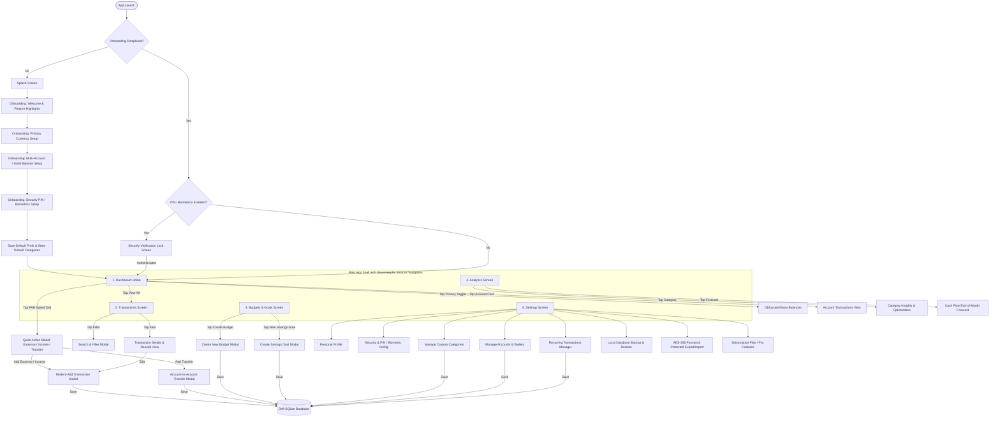

# Optimized Design Analysis & Comprehensive Phased Implementation Plan for Expendly

This document outlines the expanded technical design analysis, user flow architecture, database schema compliance, and a detailed 10-phase implementation plan for building the **Expendly** Flutter application.

It integrates and optimizes the UI/UX designs from `design/stitch/screens` following the **Modern Fiscal Core** design system while extending functionality to deliver an all-round, offline-first personal finance management experience.

---

## 1. Design Analysis & System Overview

The application adheres to the **Modern Fiscal Core** design system specified in [`design/stitch/screens/modern_fiscal_core/DESIGN.md`](file:///Users/rojanshrestha/Documents/rojan/personalProjects/expendly/design/stitch/screens/modern_fiscal_core/DESIGN.md).

### Visual & Architectural Principles
- **Theme & Palette:** Deep **Midnight Slate** (`#0E1513`) base, high-contrast **Teal** (`#57F1DB`) primary accents, and desaturated semantic colors (`#FB7185` for Expense, `#34D399` for Income).
- **Surface Elevation:** 3-tier tonal surface elevation (`#0F172A`, `#1E293B`, `#334155`) with 1px semi-transparent borders (`rgba(255,255,255,0.1)`) and glassmorphic backdrop blurs (20px blur with 60% opacity) for top headers and floating action elements.
- **Typography:** Dual typography strategy using **Hanken Grotesk** for titles/headings and **JetBrains Mono** for precise monetary figures, timestamps, and metadata.
- **Micro-Interactions:** Physical touch feedback (0.98x compression scale on tap, subtle teal glow on active/focus state).
- **Privacy Mode:** One-tap balance obfuscation (hides numerical figures with `•••••` across dashboard and transaction views).
- **State Management & Rebuild Optimization Policy (STRICT):** Direct usage of `setState` is strictly prohibited throughout the application. All local UI states, reactive toggles, keypad entries, and search query filters MUST use lightweight `ValueNotifier` and `ValueListenableBuilder` to isolate widget rebuilds and maximize runtime rendering performance.

---

## 2. Optimized User Flow Diagram

The diagram below maps the navigation and interaction flows across the application, incorporating enhanced onboarding, multi-account handling, savings goals, and encrypted backup/restore workflows:



---

## 3. Local Database Architecture Compliance & Schema Extensions

The application utilizes **Drift** (SQLite in Dart) as its local database engine. The tables cover core entities and include schema extensions for multi-account support, transfers, savings goals, and receipt attachments:

### Schema Specifications:

1. **`Accounts` Table** (`accounts.dart`):
   - `id` (`IntColumn`, PK, AutoIncrement)
   - `name` (`TextColumn`, e.g., "Cash Wallet", "Main Bank", "Credit Card")
   - `type` (`TextColumn`, e.g., "cash", "bank", "credit", "savings")
   - `initialBalance` (`RealColumn`, default 0.0)
   - `currentBalance` (`RealColumn`, default 0.0)
   - `currencySymbol` (`TextColumn`)
   - `colorHex` (`TextColumn`)
   - `iconName` (`TextColumn`)
   - `isDefault` (`BoolColumn`, default false)

2. **`Transactions` Table** (`transactions.dart`):
   - `id` (`IntColumn`, PK, AutoIncrement)
   - `amount` (`RealColumn`)
   - `type` (`TextColumn`, "expense", "income", "transfer")
   - `categoryId` (`IntColumn`, nullable, FK to `Categories`)
   - `accountId` (`IntColumn`, FK to `Accounts`)
   - `transferAccountId` (`IntColumn`, nullable, FK to `Accounts` for transfers)
   - `recurringTransactionId` (`IntColumn`, nullable, FK to `RecurringTransactions`)
   - `transactionDate` (`DateTimeColumn`)
   - `note` (`TextColumn`, nullable)
   - `receiptImagePath` (`TextColumn`, nullable, local file path)
   - `tags` (`TextColumn`, nullable, comma-separated tags)

3. **`Budgets` Table** (`budgets.dart`):
   - `id` (`IntColumn`, PK, AutoIncrement)
   - `categoryId` (`IntColumn`, nullable, FK to `Categories` - null means overall monthly budget)
   - `amount` (`RealColumn`)
   - `year` (`IntColumn`)
   - `month` (`IntColumn`)
   - `isRolloverEnabled` (`BoolColumn`, default false)

4. **`SavingsGoals` Table** (`savings_goals.dart`):
   - `id` (`IntColumn`, PK, AutoIncrement)
   - `title` (`TextColumn`)
   - `targetAmount` (`RealColumn`)
   - `currentAmount` (`RealColumn`, default 0.0)
   - `targetDate` (`DateTimeColumn`, nullable)
   - `colorHex` (`TextColumn`)
   - `iconName` (`TextColumn`)

5. **`RecurringTransactions` Table** (`recurring_transactions.dart`):
   - `id` (`IntColumn`, PK, AutoIncrement)
   - `amount` (`RealColumn`)
   - `type` (`TextColumn`)
   - `categoryId` (`IntColumn`, FK to `Categories`)
   - `accountId` (`IntColumn`, FK to `Accounts`)
   - `frequency` (`TextColumn`, e.g., "daily", "weekly", "monthly", "yearly")
   - `startDate` (`DateTimeColumn`)
   - `lastProcessedDate` (`DateTimeColumn`, nullable)
   - `isAutoCreate` (`BoolColumn`, default true)
   - `isActive` (`BoolColumn`, default true)
   - `note` (`TextColumn`, nullable)

6. **`Categories` Table** (`categories.dart`):
   - `id` (`IntColumn`, PK, AutoIncrement)
   - `name` (`TextColumn`)
   - `type` (`TextColumn`, "expense" or "income")
   - `iconName` (`TextColumn`)
   - `colorHex` (`TextColumn`)
   - `isDefault` (`BoolColumn`, default false)
   - `sortOrder` (`IntColumn`, default 0)

7. **`UserPreferences` & Secure Storage Architecture** (`preference_service.dart`, `secure_storage_service.dart`, `encryption_service.dart`):
   - **`FlutterSecureStorage` (`SecureStorageService`):** Hardware-backed key-value store for sensitive data:
     - `securityPin` (String?, security PIN)
     - `masterEncryptionKey` (String, 256-bit AES master key for export/import encryption)
   - **`SharedPreferences` (`PreferenceService`):** Fast local key-value storage for standard configuration:
     - `onboardingCompleted` (bool)
     - `primaryCurrencyCode` (String, e.g., "USD", "NPR", "EUR")
     - `currencySymbol` (String, e.g., "$", "Rs.", "€")
     - `biometricsEnabled` (bool)
     - `themeMode` (String)
     - `privacyModeEnabled` (bool)
   - **`EncryptionService`:** Cryptographic engine utilizing `encrypt` package for AES-256 (CBC with PKCS7) export & import user data encryption/decryption.

---

## 4. User Review Required

> [!NOTE]
> All data and features operate **100% offline**. Data storage, calculation engines, analytics, budget alerts, and backups reside on the local device.

> [!IMPORTANT]
> **Database Versioning & Migration:** Upgrading the Drift database schema from version `1` to `2` includes migration rules to initialize default accounts and preserve existing transactions.

---

## 5. Phased Implementation Plan

The implementation is structured into **10 sequential phases**:

```
┌────────────────────────────────────────────────────────────────────────┐
│ Phase 1: Design System & Core Reusable UI Component Library            │
├────────────────────────────────────────────────────────────────────────┤
│ Phase 2: Database Schema v2, Repositories & Storage Security Engine    │
├────────────────────────────────────────────────────────────────────────┤
│ Phase 3: Comprehensive Onboarding & Security Authentication Module     │
├────────────────────────────────────────────────────────────────────────┤
│ Phase 4: Core Shell, Glassmorphic Navigation & Modern Dashboard       │
├────────────────────────────────────────────────────────────────────────┤
│ Phase 5: Multi-Account & Advanced Transaction Management Engine        │
├────────────────────────────────────────────────────────────────────────┤
│ Phase 6: Smart Budgeting Engine & Savings Goals Module                │
├────────────────────────────────────────────────────────────────────────┤
│ Phase 7: Analytics, Cash Flow Forecast & Category Insights            │
├────────────────────────────────────────────────────────────────────────┤
│ Phase 8: Custom Categories Manager & Background Recurring Engine       │
├────────────────────────────────────────────────────────────────────────┤
│ Phase 9: Settings, Profile, Local Backup & AES-256 Export/Import       │
├────────────────────────────────────────────────────────────────────────┤
│ Phase 10: System Integration, Performance Optimization & End-to-End Audit│
└────────────────────────────────────────────────────────────────────────┘
```

---

### Detailed Phase Breakdown

---

### Phase 1: Design System & Core Reusable UI Component Library

**Goal:** Establish design system tokens, typography scale, surface elevation, glassmorphism utilities, and common widgets in `lib/core/`.

#### Key Features & Optimizations:
- Complete color tokens matching `modern_fiscal_core/DESIGN.md`.
- Dual typography setup: **Hanken Grotesk** for UI text and **JetBrains Mono** for numbers, amounts, and dates.
- Glassmorphic backdrop blur container (`GlassContainer`) with border stroke.
- Custom numerical keypad (`CustomKeypad`) with inline decimal & clear actions.
- Tactile press feedback (`0.98x` scale compression).
- Universal status alerts & toast manager (`StatusComponents`).

#### Modified & Created Files:
- **[MODIFY]** [`pubspec.yaml`](file:///Users/rojanshrestha/Documents/rojan/personalProjects/expendly/pubspec.yaml)
- **[MODIFY]** [`app_theme.dart`](file:///Users/rojanshrestha/Documents/rojan/personalProjects/expendly/lib/core/theme/app_theme.dart)
- **[NEW]** [`app_colors.dart`](file:///Users/rojanshrestha/Documents/rojan/personalProjects/expendly/lib/core/theme/app_colors.dart)
- **[NEW]** [`glass_container.dart`](file:///Users/rojanshrestha/Documents/rojan/personalProjects/expendly/lib/core/widgets/glass_container.dart)
- **[NEW]** [`custom_keypad.dart`](file:///Users/rojanshrestha/Documents/rojan/personalProjects/expendly/lib/core/widgets/custom_keypad.dart)
- **[NEW]** [`status_components.dart`](file:///Users/rojanshrestha/Documents/rojan/personalProjects/expendly/lib/core/widgets/status_components.dart)

#### Verification:
- Run `flutter analyze` to ensure zero compilation issues.
- Verify color contrast ratios and font rendering across iOS and Android themes.

---

### Phase 2: Database Schema v2, Repositories & Storage Security Engine

**Goal:** Extend Drift database schema to version 2, establish repositories, and configure secure storage & encryption services.

#### Key Features & Optimizations:
- Add `Accounts` table and `SavingsGoals` table.
- Update `Transactions`, `Budgets`, `RecurringTransactions`, and `Categories` tables.
- Hardware-backed secure storage via `SecureStorageService` for security PIN and master key.
- AES-256 string encryption/decryption engine (`EncryptionService`).
- Non-sensitive user preference management via `PreferenceService` with legacy PIN auto-migration.

#### Modified & Created Files:
- **[NEW]** [`accounts.dart`](file:///Users/rojanshrestha/Documents/rojan/personalProjects/expendly/lib/core/database/tables/accounts.dart)
- **[NEW]** [`savings_goals.dart`](file:///Users/rojanshrestha/Documents/rojan/personalProjects/expendly/lib/core/database/tables/savings_goals.dart)
- **[MODIFY]** [`transactions.dart`](file:///Users/rojanshrestha/Documents/rojan/personalProjects/expendly/lib/core/database/tables/transactions.dart)
- **[MODIFY]** [`budgets.dart`](file:///Users/rojanshrestha/Documents/rojan/personalProjects/expendly/lib/core/database/tables/budgets.dart)
- **[MODIFY]** [`recurring_transactions.dart`](file:///Users/rojanshrestha/Documents/rojan/personalProjects/expendly/lib/core/database/tables/recurring_transactions.dart)
- **[MODIFY]** [`categories.dart`](file:///Users/rojanshrestha/Documents/rojan/personalProjects/expendly/lib/core/database/tables/categories.dart)
- **[MODIFY]** [`app_database.dart`](file:///Users/rojanshrestha/Documents/rojan/personalProjects/expendly/lib/core/database/app_database.dart)
- **[NEW]** [`secure_storage_service.dart`](file:///Users/rojanshrestha/Documents/rojan/personalProjects/expendly/lib/core/services/secure_storage_service.dart)
- **[NEW]** [`encryption_service.dart`](file:///Users/rojanshrestha/Documents/rojan/personalProjects/expendly/lib/core/services/encryption_service.dart)
- **[MODIFY]** [`preference_service.dart`](file:///Users/rojanshrestha/Documents/rojan/personalProjects/expendly/lib/core/services/preference_service.dart)
- **[NEW]** [`register_module.dart`](file:///Users/rojanshrestha/Documents/rojan/personalProjects/expendly/lib/core/di/register_module.dart)
- **[MODIFY]** [`injection.dart`](file:///Users/rojanshrestha/Documents/rojan/personalProjects/expendly/lib/core/di/injection.dart)

#### Verification:
- Run `dart run build_runner build --delete-conflicting-outputs`.
- Run unit tests in `test/core/services/` to verify AES-256 encryption and PIN migration.

---

### Phase 3: Comprehensive Onboarding & Security Authentication Module

**Goal:** Build a smooth onboarding sequence and secure lock screen module.

#### Key Features & Optimizations:
- **Feature Highlights Carousel:** 3-slide introduction emphasizing privacy, offline-first local storage, and smart budgeting.
- **Currency Setup:** Searchable currency selector supporting global fiat currencies.
- **Multi-Account / Initial Balance Setup:** Create initial Cash Wallet and Bank Account with starting balances.
- **Optional Security PIN & Biometrics Config:** Step to set up a 4-digit PIN during onboarding.
- **Security Verification Screen:** Lock screen with shake animation on invalid PIN and biometric authentication button.

#### Modified & Created Files:
- **[MODIFY]** [`splash_page.dart`](file:///Users/rojanshrestha/Documents/rojan/personalProjects/expendly/lib/features/splash/presentation/pages/splash_page.dart)
- **[NEW]** [`onboarding_carousel_page.dart`](file:///Users/rojanshrestha/Documents/rojan/personalProjects/expendly/lib/features/onboarding/presentation/pages/onboarding_carousel_page.dart)
- **[NEW]** [`currency_setup_page.dart`](file:///Users/rojanshrestha/Documents/rojan/personalProjects/expendly/lib/features/onboarding/presentation/pages/currency_setup_page.dart)
- **[NEW]** [`account_setup_page.dart`](file:///Users/rojanshrestha/Documents/rojan/personalProjects/expendly/lib/features/onboarding/presentation/pages/account_setup_page.dart)
- **[NEW]** [`final_setup_page.dart`](file:///Users/rojanshrestha/Documents/rojan/personalProjects/expendly/lib/features/onboarding/presentation/pages/final_setup_page.dart)
- **[NEW]** [`security_verification_page.dart`](file:///Users/rojanshrestha/Documents/rojan/personalProjects/expendly/lib/features/security/presentation/pages/security_verification_page.dart)

#### Verification:
- Test fresh launch flow: Splash -> Carousel -> Currency -> Account -> Security Setup -> Dashboard.
- Verify security verification lock screen blocks app entry until valid PIN or biometrics authentication.

---

### Phase 4: Core Shell, Glassmorphic Navigation & Modern Dashboard

**Goal:** Implement main application shell, bottom navigation, and modern dashboard with financial metrics.

#### Key Features & Optimizations:
- **Glassmorphic Navigation Bar:** Floating bottom navigation with active tab indicator and backdrop blur.
- **Quick Action Speed Dial FAB:** Modal trigger allowing quick choice of Add Expense, Add Income, or Account Transfer.
- **Privacy Mode Toggle:** Eye icon header button to obfuscate/reveal monetary amounts (`•••••`).
- **Financial Summary Card:** Gradient card showing Total Net Worth, Monthly Income, Monthly Expense, and Cash Flow indicator.
- **Multi-Account Carousel:** Horizontally swipeable account cards showing individual balances.
- **Recent Activity Feed:** Date-grouped transaction list with empty state card when no transactions exist.

#### Modified & Created Files:
- **[MODIFY]** [`dashboard_page.dart`](file:///Users/rojanshrestha/Documents/rojan/personalProjects/expendly/lib/features/dashboard/presentation/pages/dashboard_page.dart)
- **[NEW]** [`app_shell_page.dart`](file:///Users/rojanshrestha/Documents/rojan/personalProjects/expendly/lib/features/dashboard/presentation/pages/app_shell_page.dart)
- **[NEW]** [`empty_dashboard_widget.dart`](file:///Users/rojanshrestha/Documents/rojan/personalProjects/expendly/lib/features/dashboard/presentation/widgets/empty_dashboard_widget.dart)
- **[NEW]** [`financial_summary_card.dart`](file:///Users/rojanshrestha/Documents/rojan/personalProjects/expendly/lib/features/dashboard/presentation/widgets/financial_summary_card.dart)
- **[NEW]** [`accounts_carousel_widget.dart`](file:///Users/rojanshrestha/Documents/rojan/personalProjects/expendly/lib/features/dashboard/presentation/widgets/accounts_carousel_widget.dart)
- **[NEW]** [`speed_dial_modal.dart`](file:///Users/rojanshrestha/Documents/rojan/personalProjects/expendly/lib/features/dashboard/presentation/widgets/speed_dial_modal.dart)

#### Verification:
- Verify tab switching and smooth glassmorphic blur rendering at 60fps.
- Verify Privacy Mode hides and reveals all balance figures instantly.

---

### Phase 5: Multi-Account & Advanced Transaction Management Engine

**Goal:** Build full transaction capability, including entry form, transfer mode, receipt attachments, details, and search/filter.

#### Key Features & Optimizations:
- **Modern Add Transaction Modal:** Custom numeric keypad input with category selector, account selector, date picker, note field, and tag input.
- **Account Transfer Modal:** Dedicated flow to transfer funds between accounts with automatic balance update.
- **Receipt Photo Attachment:** Capture or pick receipt image stored locally in app documents directory.
- **All Transactions Screen:** Infinite scrolling or month-grouped list of transactions with category icons.
- **Transaction Details View:** Detailed breakdown showing category, account, timestamp, note, tag chips, and receipt viewer.
- **Search & Filter Drawer:** Filter by date range, transaction type, category, account, and keyword search.

#### Modified & Created Files:
- **[NEW]** [`modern_add_transaction_page.dart`](file:///Users/rojanshrestha/Documents/rojan/personalProjects/expendly/lib/features/transactions/presentation/pages/modern_add_transaction_page.dart)
- **[NEW]** [`transfer_transaction_page.dart`](file:///Users/rojanshrestha/Documents/rojan/personalProjects/expendly/lib/features/transactions/presentation/pages/transfer_transaction_page.dart)
- **[NEW]** [`all_transactions_page.dart`](file:///Users/rojanshrestha/Documents/rojan/personalProjects/expendly/lib/features/transactions/presentation/pages/all_transactions_page.dart)
- **[NEW]** [`transaction_details_page.dart`](file:///Users/rojanshrestha/Documents/rojan/personalProjects/expendly/lib/features/transactions/presentation/pages/transaction_details_page.dart)
- **[NEW]** [`search_filter_modal.dart`](file:///Users/rojanshrestha/Documents/rojan/personalProjects/expendly/lib/features/transactions/presentation/pages/search_filter_modal.dart)
- **[NEW]** [`empty_transactions_widget.dart`](file:///Users/rojanshrestha/Documents/rojan/personalProjects/expendly/lib/features/transactions/presentation/widgets/empty_transactions_widget.dart)

#### Verification:
- Test adding expense, income, and account-to-account transfer transactions.
- Verify Drift database updates account balances correctly upon transaction creation, edit, or deletion.

---

### Phase 6: Smart Budgeting Engine & Savings Goals Module

**Goal:** Implement category budgeting, overall monthly cap, threshold warnings, and savings goals.

#### Key Features & Optimizations:
- **Budgets Overview:** Monthly total spending vs budget limit, category-specific progress bars with percentage indicators.
- **Threshold Alert System:** Soft red glowing animation and notification tag when budget usage exceeds 90%.
- **Create Budget Modal:** Set monthly budget caps for specific categories or overall spending limit.
- **Savings Goals Module:** Track goals (e.g., Emergency Fund, Vacation, New Gadget) with target amounts, target dates, and progress deposit buttons.

#### Modified & Created Files:
- **[NEW]** [`budgets_overview_page.dart`](file:///Users/rojanshrestha/Documents/rojan/personalProjects/expendly/lib/features/budgets/presentation/pages/budgets_overview_page.dart)
- **[NEW]** [`create_new_budget_page.dart`](file:///Users/rojanshrestha/Documents/rojan/personalProjects/expendly/lib/features/budgets/presentation/pages/create_new_budget_page.dart)
- **[NEW]** [`savings_goals_page.dart`](file:///Users/rojanshrestha/Documents/rojan/personalProjects/expendly/lib/features/budgets/presentation/pages/savings_goals_page.dart)
- **[NEW]** [`create_savings_goal_page.dart`](file:///Users/rojanshrestha/Documents/rojan/personalProjects/expendly/lib/features/budgets/presentation/pages/create_savings_goal_page.dart)
- **[NEW]** [`empty_budgets_widget.dart`](file:///Users/rojanshrestha/Documents/rojan/personalProjects/expendly/lib/features/budgets/presentation/widgets/empty_budgets_widget.dart)

#### Verification:
- Verify calculation of total spent per category in current month against budget limit.
- Test savings goal progress updates when user logs goal contributions.

---

### Phase 7: Analytics, Cash Flow Forecast & Category Insights

**Goal:** Provide visual analytics, category expense breakdown, period filters, and financial forecasting.

#### Key Features & Optimizations:
- **Refined Analytics Screen:** Bar charts comparing Income vs Expense over time, Donut chart for category distribution.
- **Period Filter:** Dynamic filter for Weekly, Monthly, Quarterly, Yearly, or Custom Date Range.
- **Category Insights View:** Detailed deep-dive into highest spending categories with month-over-month percentage change.
- **Cash Flow Forecast:** End-of-month projected balance prediction based on average daily spending speed and upcoming recurring bills.

#### Modified & Created Files:
- **[NEW]** [`refined_reports_page.dart`](file:///Users/rojanshrestha/Documents/rojan/personalProjects/expendly/lib/features/analytics/presentation/pages/refined_reports_page.dart)
- **[NEW]** [`category_insights_page.dart`](file:///Users/rojanshrestha/Documents/rojan/personalProjects/expendly/lib/features/analytics/presentation/pages/category_insights_page.dart)
- **[NEW]** [`cash_flow_forecast_widget.dart`](file:///Users/rojanshrestha/Documents/rojan/personalProjects/expendly/lib/features/analytics/presentation/widgets/cash_flow_forecast_widget.dart)
- **[NEW]** [`empty_reports_widget.dart`](file:///Users/rojanshrestha/Documents/rojan/personalProjects/expendly/lib/features/analytics/presentation/widgets/empty_reports_widget.dart)

#### Verification:
- Verify mathematical accuracy of pie chart category percentages and monthly spending totals.

---

### Phase 8: Custom Categories Manager & Background Recurring Engine

**Goal:** Build custom category management (colors/icons) and recurring transaction scheduling with background auto-processing.

#### Key Features & Optimizations:
- **Manage Categories Screen:** Create, edit, reorder, or delete custom income and expense categories with color picker and icon grid.
- **Recurring Transactions Manager:** Schedule recurring subscriptions or bills (Daily, Weekly, Monthly, Yearly).
- **Background Auto-Processing Engine (`RecurringProcessorService`):** Checks pending recurring transactions on app launch and automatically generates due transactions.

#### Modified & Created Files:
- **[NEW]** [`manage_categories_page.dart`](file:///Users/rojanshrestha/Documents/rojan/personalProjects/expendly/lib/features/categories/presentation/pages/manage_categories_page.dart)
- **[NEW]** [`category_editor_modal.dart`](file:///Users/rojanshrestha/Documents/rojan/personalProjects/expendly/lib/features/categories/presentation/widgets/category_editor_modal.dart)
- **[NEW]** [`recurring_transactions_page.dart`](file:///Users/rojanshrestha/Documents/rojan/personalProjects/expendly/lib/features/recurring/presentation/pages/recurring_transactions_page.dart)
- **[NEW]** [`recurring_processor_service.dart`](file:///Users/rojanshrestha/Documents/rojan/personalProjects/expendly/lib/features/recurring/domain/services/recurring_processor_service.dart)

#### Verification:
- Verify that past-due recurring transactions are auto-inserted into the database with proper transaction dates upon app launch.

---

### Phase 9: Settings, Profile, Local Backup & AES-256 Export/Import

**Goal:** Build settings menu, personal profile, offline database backup/restore, and password-protected AES-256 export/import.

#### Key Features & Optimizations:
- **Settings Home Screen:** Central hub for security, accounts, categories, backup/restore, theme mode, and app information.
- **Personal Profile Screen:** User preference manager (name, default currency, avatar placeholder).
- **Local Database Backup & Restore:** Export full raw SQLite database file to local storage or restore from a local backup file.
- **AES-256 Protected Data Export & Import:** Export transactions, categories, and budgets to encrypted JSON/CSV files with user-defined password protection using `EncryptionService`.
- **Subscription / Pro Features Info Page:** Feature overview card highlighting offline privacy guarantees and Pro tools.

#### Modified & Created Files:
- **[NEW]** [`settings_page.dart`](file:///Users/rojanshrestha/Documents/rojan/personalProjects/expendly/lib/features/settings/presentation/pages/settings_page.dart)
- **[NEW]** [`personal_profile_page.dart`](file:///Users/rojanshrestha/Documents/rojan/personalProjects/expendly/lib/features/settings/presentation/pages/personal_profile_page.dart)
- **[NEW]** [`manage_accounts_page.dart`](file:///Users/rojanshrestha/Documents/rojan/personalProjects/expendly/lib/features/settings/presentation/pages/manage_accounts_page.dart)
- **[NEW]** [`local_backup_restore_page.dart`](file:///Users/rojanshrestha/Documents/rojan/personalProjects/expendly/lib/features/settings/presentation/pages/local_backup_restore_page.dart)
- **[NEW]** [`import_export_data_page.dart`](file:///Users/rojanshrestha/Documents/rojan/personalProjects/expendly/lib/features/settings/presentation/pages/import_export_data_page.dart)
- **[NEW]** [`subscription_plan_page.dart`](file:///Users/rojanshrestha/Documents/rojan/personalProjects/expendly/lib/features/settings/presentation/pages/subscription_plan_page.dart)

#### Verification:
- Export data to an encrypted file, verify raw file cannot be read without password, and perform test import restore to verify data integrity.

---

### Phase 10: System Integration, Performance Optimization & End-to-End Audit

**Goal:** Conduct full codebase audit, static analysis, unit test coverage, and performance optimization.

#### Key Features & Optimizations:
- **Static Analysis Audit:** Run `flutter analyze` to enforce zero warnings and zero lints across all core services, BLoCs, and UI components.
- **Automated Unit Testing:** Verify BLoC state transitions, Drift DAOs, `SecureStorageService`, and `EncryptionService` test suites.
- **Performance & UI Frame Rate Audit:** Ensure smooth 60fps scrolling on transaction lists and responsive glassmorphic backdrop blurs across diverse mobile device screen resolutions.

#### Modified & Created Files:
- **[NEW]** [`test/core/services/encryption_service_test.dart`](file:///Users/rojanshrestha/Documents/rojan/personalProjects/expendly/test/core/services/encryption_service_test.dart)
- **[NEW]** [`test/core/services/preference_service_test.dart`](file:///Users/rojanshrestha/Documents/rojan/personalProjects/expendly/test/core/services/preference_service_test.dart)
- **[NEW]** [`test/features/transactions/transaction_bloc_test.dart`](file:///Users/rojanshrestha/Documents/rojan/personalProjects/expendly/test/features/transactions/transaction_bloc_test.dart)

#### Verification:
- Execute `flutter analyze` and `fvm flutter test` to confirm 100% clean build and green unit test suite.

---

## 6. Verification Plan

### Automated Tests
- Run `flutter analyze` to ensure clean static analysis with zero errors/warnings.
- Run `fvm flutter test` to verify unit tests for BLoCs, Repositories, Secure Storage, AES-256 Encryption, and Drift database queries.
- Run `dart run build_runner build --delete-conflicting-outputs` to generate code for AutoRoute (`app_router.gr.dart`), Drift (`app_database.g.dart`), and Injectable DI.

### Manual Verification
- Test complete Onboarding flow on fresh app launch (Carousel -> Currency -> Accounts -> Security Setup -> Dashboard).
- Verify dark theme styling, colors, and typography match `modern_fiscal_core/DESIGN.md`.
- Test Privacy Mode balance obfuscation toggle across Dashboard and Transactions.
- Test Add Transaction with keypad, category select, account transfer, receipt photo attachment, and verify Drift database updates.
- Verify Budget progress calculation and alert triggers (>90%).
- Verify AES-256 encrypted export file generation and successful import restoration.
